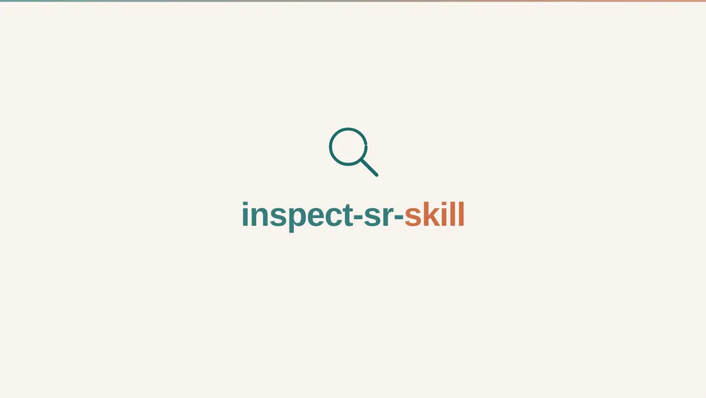

# inspect-sr-skill

> *An agent-oriented implementation of INSPECT-SR for systematic reviewers who need a second pair of eyes on potentially problematic RCTs.*

[](skills/inspect-sr-skill/SKILL.md)
[](skills/inspect-sr-skill/LICENSE)
[](https://inspect.sr/)

An agent skill that encodes the **INSPECT-SR** trustworthiness framework into a structured workflow. Point the agent at any study document (such as a PDF, registry entry, protocol, abstract, or notice) to systematically evaluate post-publication alerts, conduct and governance, text, figures, and results, without conflating trustworthiness with risk of bias, fraud detection, or generalisability.

---

<p align="center">
  
  <br/>
  <sub>Animation made with the <a href="https://github.com/alchaincyf/huashu-design">huashu-design</a> skill</sub>
</p>

---

## What it does

[INSPECT-SR](https://inspect.sr/) was developed by Jack Wilkinson and colleagues to answer one important question for systematic reviewers: *is this RCT sufficiently trustworthy to include in evidence synthesis?* It is **not** a risk-of-bias tool, not a fraud detector, and not a conflict-of-interest scorer. 

> [!IMPORTANT]
> **Not an official project!**
> This repository is an independent community-led implementation of the INSPECT-SR framework. It is not affiliated with or endorsed by the official INSPECT-SR authors and developers.

This skill packages the INSPECT-SR framework to ensure consistent, reproducible execution by LLM agents, keeping the trustworthiness assessment strictly isolated from adjacent evaluations.

This skill is designed to **assist**, not replace, the systematic reviewer. The agent proposes, but the human decides. Every INSPECT-SR assessment produced by this skill must be reviewed, critiqued, and signed off by a qualified human before it influences any review decision. The agent records its sources and reasoning so you can verify each check independently. Please always treat the output as a first draft, not a verdict.

## What's new in v0.1.0

- **Aligned with INSPECT-SR Guidance v1.1.2**: Updated guidance reflecting the latest official release, including critical nuances around rounding intervals for continuous *p*-values and proper scoping for statistical result verification.
- **Modular per-domain architecture**: Replaced monolithic guides with dedicated per-domain reference documents ([`references/domains/`](skills/inspect-sr-skill/references/domains/)) containing official check wording, specific pitfalls to avoid, and worked examples from the official guidance.
- **Local computational verification ([`scripts/`](skills/inspect-sr-skill/scripts/))**: Integrated local R scripts covering arithmetic checks so the agent computes exact bounds rather than falling back to `Unclear`:
  - Mean/SD integer consistency via GRIM and GRIMMER ([`scrutiny`](https://github.com/lhdjung/scrutiny))
  - Continuous *p*-value rounding consistency intervals and categorical test reproduction
  - Multi-variable baseline table scanning ([`reappraised`](https://cran.r-project.org/package=reappraised))
  - Subgroup mean recombination and percentage denominator checks
- **Calibrated assessment procedure**: Codified explicit Step 0 evidence boundaries ("*`No` is a claim you have to earn*"), early stopping when `serious concerns` is justified, and standardized reporting deliverables.

## Installation

The skill is built on the open [Agent Skills](https://agentskills.io) standard. It works in any skills-compatible AI agent runtime.

### Option 1: One-liner (recommended, cross-runtime)

[`npx skills`](https://github.com/vercel-labs/skills) (from Vercel Labs) reads this repo, finds [`skills/inspect-sr-skill/`](skills/inspect-sr-skill/), and drops it into the right folder for whatever agent it detects:

```bash
npx skills add emberwhirl/inspect-sr-skill
```

Alternatively, open your preferred skills-compatible agent (e.g., Hermes, Claude Code, Codex, etc.) and tell it:

```
Install this skill for me: https://github.com/emberwhirl/inspect-sr-skill
```

### Option 2: Manual clone

```bash
git clone https://github.com/emberwhirl/inspect-sr-skill.git
```

Then point your agent at the global or project-level skill directory ([`skills/inspect-sr-skill/`](skills/inspect-sr-skill/)).

### Computational dependencies

The skill includes R scripts under [`scripts/`](skills/inspect-sr-skill/scripts/) for running mathematical checks locally:
- [`pval_check.R`](skills/inspect-sr-skill/scripts/pval_check.R) and [`consistency.R`](skills/inspect-sr-skill/scripts/consistency.R) rely only on base R.
- [`grim_grimmer.R`](skills/inspect-sr-skill/scripts/grim_grimmer.R) and [`baseline_scan.R`](skills/inspect-sr-skill/scripts/baseline_scan.R) require the R packages [`scrutiny`](https://github.com/lhdjung/scrutiny) and [`reappraised`](https://cran.r-project.org/package=reappraised).

**Environment setup:**
- **R runtime**: Ensure [R](https://www.r-project.org/) is installed in your system or runtime environment.
- **Package installation**: When running in an environment where the agent has command execution permissions, the agent will install missing R packages ([`scrutiny`](https://github.com/lhdjung/scrutiny), [`reappraised`](https://cran.r-project.org/package=reappraised)) automatically when needed. If your agent is operating without terminal permissions, or if you prefer to manage dependencies manually, please install these packages in your R environment prior to running assessments.

## Usage

Once installed, the skill activates automatically when you prompt your agent in natural language about topics defined in the [`SKILL.md`](skills/inspect-sr-skill/SKILL.md) frontmatter. Any query concerning potentially problematic RCTs, post-publication notices, statistical discrepancies, or study trustworthiness will trigger the workflow.

Example prompts you can paste:

```text
"Perform INSPECT-SR on the Strasser 2023 trial."
```

## License

This skill is released under the [MIT License](skills/inspect-sr-skill/LICENSE).

The original INSPECT-SR tool and guidance are copyrighted by their authors and licensed under [CC-BY 4.0](https://creativecommons.org/licenses/by/4.0/). When you use this skill to support review methods or reporting, please preserve attribution to the official INSPECT-SR guidance and cite Wilkinson et al. (see [Citation](#citation)).

## Repository structure

```
inspect-sr-skill/
  ├── README.md                                       
  ├── assets/
  │   └── walkthrough.webp                            
  └── skills/inspect-sr-skill/                        
      ├── SKILL.md                                    
      ├── LICENSE                                     
      ├── references/
      │   ├── domains/
      │   │   ├── 1-post-publication-notices.md
      │   │   ├── 2-conduct-governance-transparency.md
      │   │   ├── 3-text-and-figures.md
      │   │   └── 4-results-in-the-study.md
      │   ├── table-template.md                       
      │   └── Wilkinson_MedRxiv_40950444_MEDLINE.txt  
      └── scripts/
          ├── README.md
          ├── baseline_scan.R
          ├── consistency.R
          ├── grim_grimmer.R
          └── pval_check.R
```

## Citation

If this skill supports your review or methods write-up, please cite the original INSPECT-SR preprint:

> Wilkinson J, Heal C, Flemyng E, et al. INSPECT-SR: a tool for assessing trustworthiness of randomised controlled trials. ***medRxiv***. 2025:2025.09.03.25334905. doi:[10.1101/2025.09.03.25334905](https://doi.org/10.1101/2025.09.03.25334905). PMID: [40950444](https://pubmed.ncbi.nlm.nih.gov/40950444/); PMCID: [PMC12424918](https://pmc.ncbi.nlm.nih.gov/articles/PMC12424918/).

A copy of the MEDLINE (txt) format citation is bundled at [`skills/inspect-sr-skill/references/`](skills/inspect-sr-skill/references/Wilkinson_MedRxiv_40950444_MEDLINE.txt) for convenience when managing bibliographies.

## Acknowledgements

- The [INSPECT-SR](https://inspect.sr/) team for the elegant tool
- Ian Hussey ([@ianhussey](https://github.com/ianhussey)), maintainer of the [INSPECT-SR guidance repository](https://github.com/ianhussey/inspect-sr-guidance)
- Lukas Jung ([@lhdjung](https://github.com/lhdjung)) for [`scrutiny`](https://github.com/lhdjung/scrutiny)
- Mark Bolland for [`reappraised`](https://cran.r-project.org/package=reappraised)
